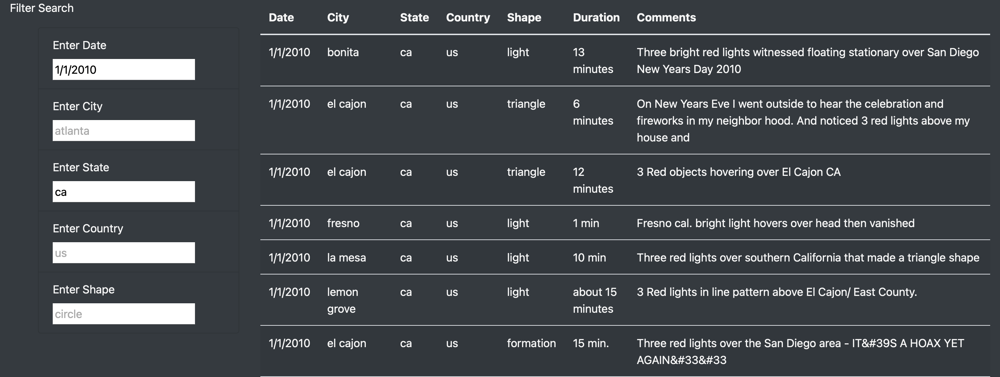

# UFOs

### Resources
* HTML, JavaScript, CSS
* Bootstrap, D3.

## Overview

This project compiles data from different UFO encounters around the US in order to present them on one easy to use webpage. it also offers the user the ability to filter the encounters using different criteria, including the date, city, state... etc.  
the page can be viewed by clicking [here](https://mlachha.github.io/UFOs/).

## Results

the webpage has been designed to fit the data in an easy-to-understand table structure, this is a picture of the webpage at opening:

the results are then able to be filtered using the filter fields these are examples of how the results show after applying the filters:

on the page you can scroll down to see the rest of the results and different information about each of them. 

## Summary

This webpage gives a great overview of UFO sightings in the US, but it does have a few shortcomings. The biggest one is that does not have the functionality to add live data as it comes in. The data that is a part of the data file will stay the same unless someone manually goes in and updates it.

The two recommendations for future changes I can think of would be to implement live data functionality and be able to do some work on the comments.
